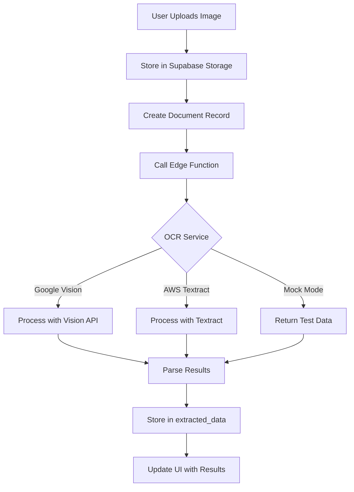

# OCR Setup Guide for EasyRecord

## Overview

EasyRecord uses server-side OCR processing through Supabase Edge Functions to achieve high accuracy in extracting data from handwritten registers. This guide will help you set up the OCR service.

## Architecture

1. **User uploads image** → Stored in Supabase Storage
2. **Edge Function triggered** → Processes image with OCR
3. **Data extracted** → Stored in `extracted_data` table
4. **User sees results** → Editable table with download options

## Setup Steps

### 1. Enable Supabase Edge Functions

```bash
# In your project directory
cd supabase
npx supabase functions deploy process-ocr
```

### 2. Configure OCR Service

#### Option A: Google Vision API (Recommended for accuracy)

1. Go to [Google Cloud Console](https://console.cloud.google.com)
2. Create a new project or select existing
3. Enable Vision API
4. Create credentials (API Key)
5. Add to Supabase Edge Function secrets:

```bash
npx supabase secrets set GOOGLE_VISION_API_KEY=your_api_key_here
```

#### Option B: AWS Textract (Good for forms and tables)

1. Create AWS account
2. Get Access Key and Secret Key
3. Add to Supabase secrets:

```bash
npx supabase secrets set AWS_ACCESS_KEY_ID=your_key
npx supabase secrets set AWS_SECRET_ACCESS_KEY=your_secret
npx supabase secrets set AWS_REGION=us-east-1
```

#### Option C: Development Mode (Mock Data)

If no API keys are provided, the system uses mock data for testing.

### 3. Database Migration

Run the migration to create the `extracted_data` table:

```bash
npx supabase db push
```

### 4. Test the Setup

1. Start your development server
2. Upload a sample image
3. Check the processing status
4. Verify extracted data appears in the table

## OCR Processing Flow



## Data Format

The extracted data is stored in JSONB format:

```json
{
  "headers": ["Date", "Item", "Quantity", "Rate", "Amount"],
  "rows": [
    {
      "Date": "01-01-2024",
      "Item": "Rice",
      "Quantity": "25",
      "Rate": "45",
      "Amount": "1125"
    }
  ]
}
```

## Supported Formats

The OCR system is optimized for:
- Indian business registers (Hindi/English)
- Tabular data with columns
- Common patterns: Date, Item, Quantity, Rate, Amount
- Handwritten and printed text

## Accuracy Tips

1. **Image Quality**: Higher resolution = better accuracy
2. **Lighting**: Even lighting without shadows
3. **Angle**: Straight-on photos work best
4. **Format**: Clear table structure helps parsing

## Editing Extracted Data

Users can:
- Click any cell to edit
- Press Enter to save
- Press Escape to cancel
- Edited data is marked with a badge

## Troubleshooting

### "Nothing is happening" after upload
- Check Edge Function logs: `npx supabase functions logs process-ocr`
- Verify API keys are set correctly
- Check browser console for errors

### Low accuracy results
- Ensure good image quality
- Try different OCR services
- Use the editing feature to correct data

### Processing fails
- Check Supabase storage policies
- Verify user authentication
- Check Edge Function deployment status

## Cost Considerations

- **Google Vision**: $1.50 per 1000 images
- **AWS Textract**: $1.50 per 1000 pages
- **Storage**: Included in Supabase plan

## Security

- All processing happens server-side
- User data is isolated by RLS policies
- API keys are stored as secrets
- Images are stored in private buckets